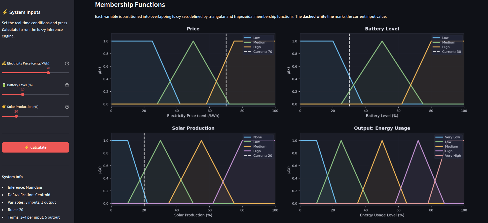
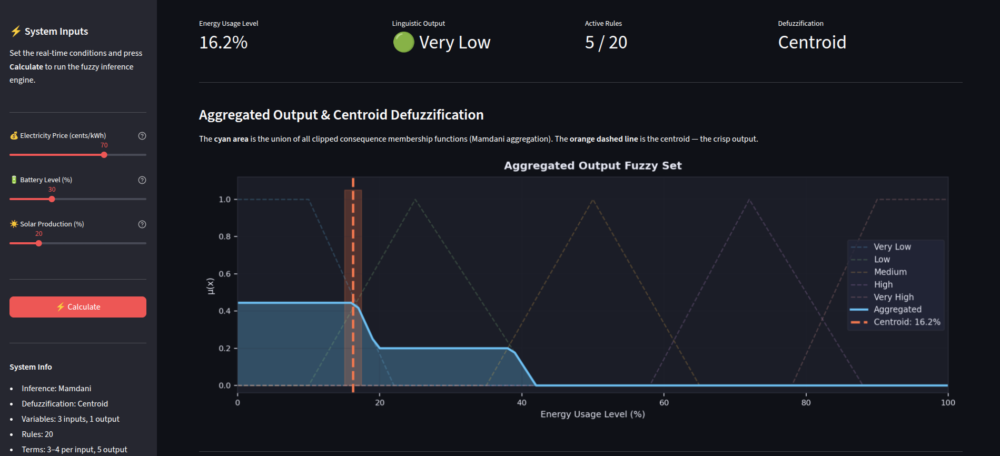
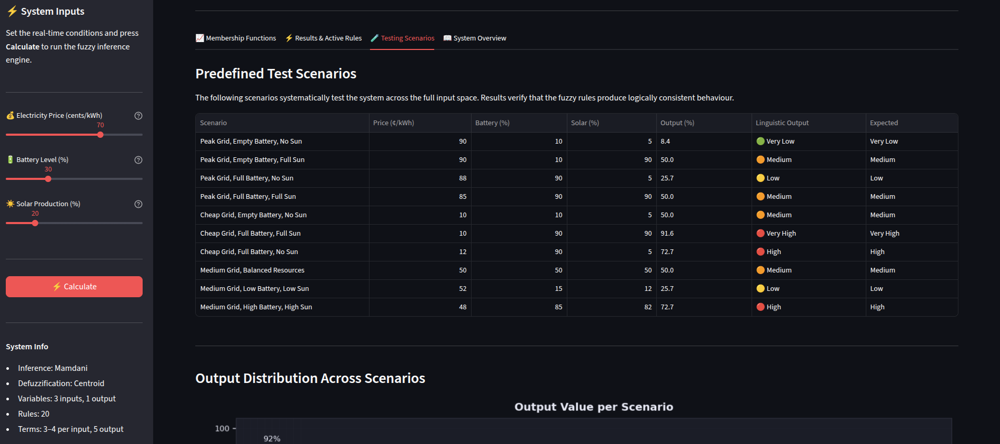
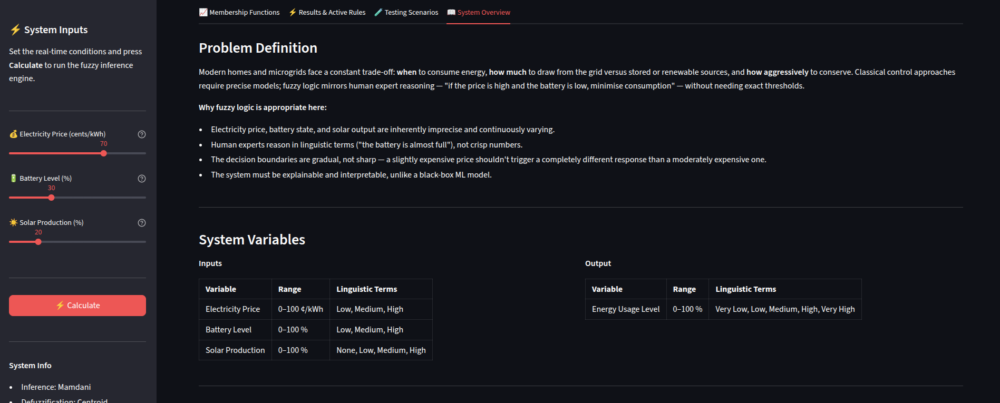

# Smart Energy Consumption Controller ⚡

A Streamlit-based decision support system that uses Mamdani fuzzy logic to recommend an optimal energy usage level from real-time electricity price, battery level, and solar production.

## Overview

Smart Energy Consumption Controller models a simple home or microgrid energy-management problem. Instead of relying on fixed thresholds, the system uses fuzzy logic to handle uncertain and gradual conditions such as "high price", "low battery", or "medium solar production".

The application converts crisp input values into fuzzy membership degrees, evaluates a rule base, aggregates the active output sets, and defuzzifies the result into a clear energy usage recommendation.

### **[View Live Demo](https://smart-energy-controller.streamlit.app/)** 👁️

## Download Project Report PDF (TR)

[Download ABDALRAZAK_KHALED_22430070907.pdf](assets/docs/ABDALRAZAK_KHALED_22430070907.pdf)

## Screenshots

### 1. Membership Functions

Capture the plots for electricity price, battery level, solar production, and output energy usage.




### 2. Results and Active Rules

After pressing `Calculate`, capture the output metrics, aggregated output plot, centroid marker, and fired rules.



### 3. Testing Scenarios

Capture the predefined scenario table and scenario output distribution chart.



### 4. System Overview

Capture the rule base, inference method, and fuzzy logic explanation sections.



## Key Features

- Interactive Streamlit interface with sliders for all input variables.
- Mamdani fuzzy inference engine.
- Centroid defuzzification for crisp output generation.
- Visual membership function plots for all inputs and the output variable.
- Active rule inspection with activation strength values.
- Aggregated output visualization with centroid marker.
- Predefined test scenarios for validating system behavior.
- Explainable rule-based decision process.
- Dark dashboard layout designed for clear technical presentation.

## System Inputs and Output

| Variable | Type | Range | Linguistic Terms | Description |
|---|---|---:|---|---|
| Electricity Price | Input | 0-100 cents/kWh | Low, Medium, High | Current grid electricity price |
| Battery Level | Input | 0-100% | Low, Medium, High | Current battery state of charge |
| Solar Production | Input | 0-100% | None, Low, Medium, High | Current solar generation level |
| Energy Usage Level | Output | 0-100% | Very Low, Low, Medium, High, Very High | Recommended energy consumption level |

## Fuzzy Logic Properties

| Property | Value |
|---|---|
| Inference method | Mamdani |
| Rule evaluation | Min operator |
| Aggregation | Max operator |
| Defuzzification | Centroid |
| Input variables | 3 |
| Output variables | 1 |
| Rule count | 20 |
| Membership function types | Triangular and trapezoidal |
| Implementation language | Python |
| Interface framework | Streamlit |
| Visualization library | Matplotlib |

## How the System Works

1. The user sets electricity price, battery level, and solar production from the sidebar.
2. Each crisp input is converted into fuzzy membership values.
3. The fuzzy rule base determines which rules are activated.
4. Activated rule outputs are clipped and aggregated into one output fuzzy set.
5. Centroid defuzzification converts the aggregated output into a crisp energy usage percentage.
6. The app displays the final recommendation, active rules, plots, and scenario analysis.

## Example Decision Logic

The controller follows human-readable reasoning such as:

- If electricity price is high, battery is low, and solar production is low, reduce energy usage.
- If electricity price is low, battery is high, and solar production is high, allow very high energy usage.
- If all conditions are balanced, recommend a medium usage level.

## Technology Stack

- Python
- Streamlit
- NumPy
- SciPy
- scikit-fuzzy
- Matplotlib
- NetworkX

## Run Locally

Use the included script:

```bash
./run_app.sh
```

Then open:

```text
http://localhost:8501
```

To run on another port:

```bash
PORT=5000 ./run_app.sh
```

## Manual Setup

Create and activate a virtual environment:

```bash
python3 -m venv venv
source venv/bin/activate
```

Install dependencies:

```bash
pip install -r requirements.txt
```

Run the app:

```bash
streamlit run app.py
```

## Notes

This project is designed as an interpretable control-system prototype. It is suitable for demonstrating fuzzy logic, energy-management decision rules, and explainable AI concepts in a compact interactive application.
