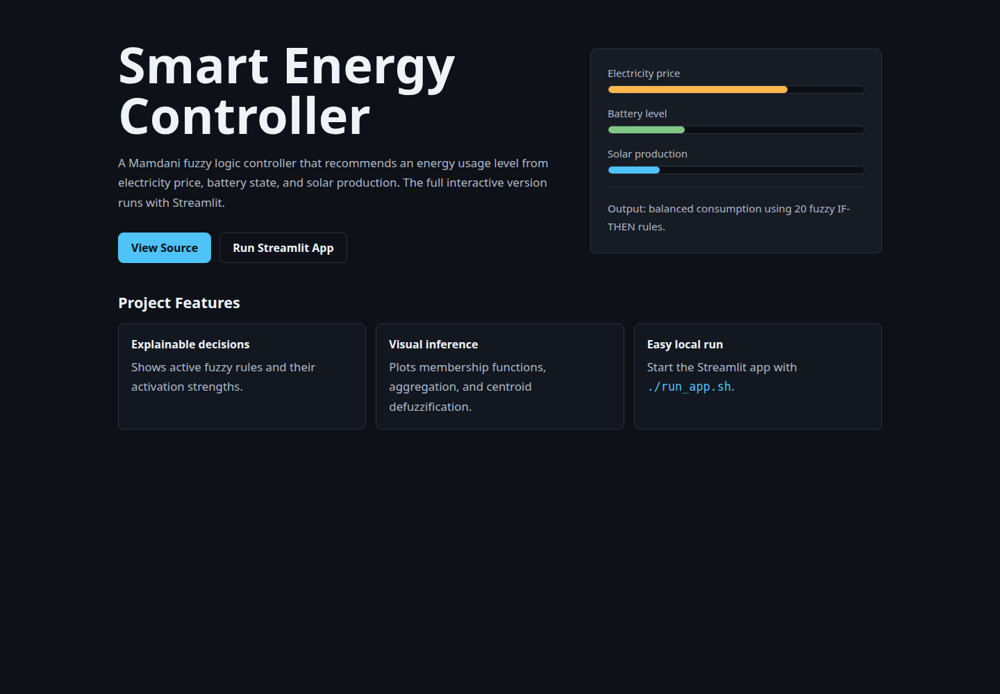

# Smart Energy Consumption Controller

A Mamdani fuzzy logic system that determines the optimal energy usage level from electricity price, battery state, and solar production.

## Live Demo

- Vercel demo page: add your deployed Vercel URL here after deployment.
- Local Streamlit app: run `./run_app.sh`

Important: Vercel's Python runtime expects an ASGI/WSGI `app`, `application`, or `handler`. Streamlit apps do not expose that kind of entrypoint, so this repository uses Vercel for a static project demo page and keeps the full interactive dashboard as a Streamlit app.

## Screenshots

### Vercel Demo Page



### Streamlit Dashboard

Add dashboard screenshots in `assets/screenshots/` and reference them here.

```md


```

## What This Project Does

This system acts as a smart energy controller for a home or microgrid. Given three inputs, it uses fuzzy logic to decide how aggressively the system should consume energy.

| Input | Range | Description |
|---|---:|---|
| Electricity Price | 0-100 cents/kWh | Current grid purchase price |
| Battery Level | 0-100% | State of charge of battery storage |
| Solar Production | 0-100% | Solar panel output as percentage of peak capacity |

| Output | Range | Meaning |
|---|---:|---|
| Energy Usage Level | 0-100% | How much energy the system should consume |

The system uses 20 fuzzy IF-THEN rules, Mamdani inference, and centroid defuzzification.

## Quick Start

Run the app with one command:

```bash
./run_app.sh
```

The script creates `venv/` if needed, installs missing dependencies from `requirements.txt`, and starts Streamlit.

Open the app at:

```text
http://localhost:8501
```

To use a different port:

```bash
PORT=5000 ./run_app.sh
```

## Manual Setup

Create and activate a virtual environment:

```bash
python3 -m venv venv
source venv/bin/activate
```

Install dependencies:

```bash
pip install -r requirements.txt
```

Run the app:

```bash
streamlit run app.py
```

## How to Use the App

1. Adjust the sidebar sliders for electricity price, battery level, and solar production.
2. Click `Calculate` to run the fuzzy inference engine.
3. Explore the tabs for membership functions, active rules, testing scenarios, and the system overview.

## Technical Overview

- Inference method: Mamdani min-max
- Defuzzification: centroid
- Membership functions: triangular and trapezoidal
- Inputs: electricity price, battery level, solar production
- Output: energy usage level
- Rule base: 20 IF-THEN rules

## Deploying the Demo Page to Vercel

This repo includes `vercel.json` and `public/index.html` for a Vercel-compatible static demo page.

1. Push the repository to GitHub.
2. Import the project in Vercel.
3. Keep the framework preset as `Other`.
4. Deploy.

The Vercel page is a project showcase. For the full interactive Streamlit app, run locally with `./run_app.sh` or deploy the Streamlit app to a Streamlit-friendly host.

## Project Structure

```text
.
├── app.py
├── fuzzy_system/
│   ├── __init__.py
│   └── controller.py
├── public/
│   └── index.html
├── assets/
│   └── screenshots/
├── run_app.sh
├── requirements.txt
├── vercel.json
└── README.md
```
